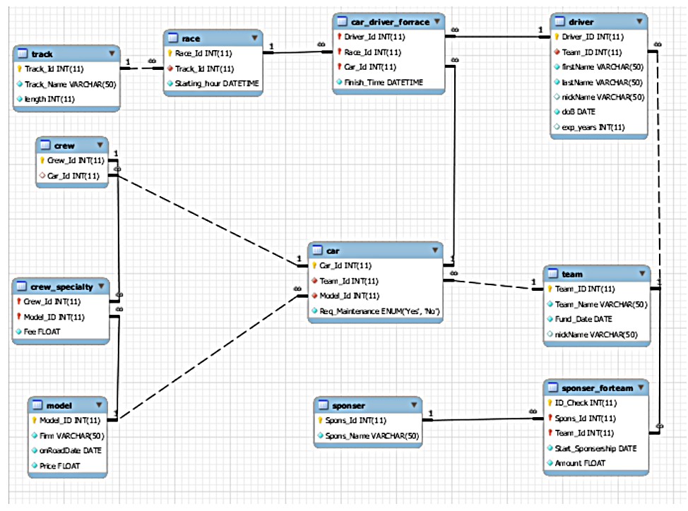

## Project: Car Racing Management System

### Description:
Implementing a database system to manage car races in a distant country, featuring various car models and teams competing on designated routes. The system records race details, participant information, and sponsorship data.

### Entities:

##### Cars:
Attributes: Car_ID (Primary Key), Model, Status. 
Description: Records details of cars participating in races.

##### Teams:
Attributes: Team_ID (Primary Key), Team_Name, Founded_Date. 
Description: Stores information about racing teams.

##### Drivers:
Attributes: Driver_ID (Primary Key), Full_Name, Nickname, Team_ID (Foreign Key), Date_of_Birth, Experience_Years. 
Description: Manages data of drivers participating in races, including their affiliations.

##### Races:
Attributes: Race_ID (Primary Key), Race_Date, Start_Time, Route, Length_km. 
Description: Stores information about each race, including its date, time, and route.

##### Sponsorships:
Attributes: Sponsor_ID (Primary Key), Sponsor_Name, Team_ID (Foreign Key), Sponsorship_Date, Financial_Value. 
Description: Records sponsorship details for teams participating in races.

### SQL schema

After creating the DB, I created several possible users such as Racing Fans Club, Team Manager and Team Leader and created suitable SQL queries which help the user extract valuable information (which are in the Code folder).